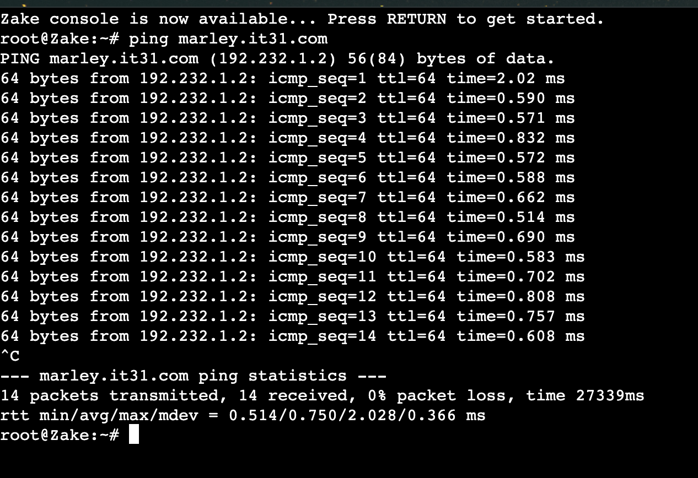
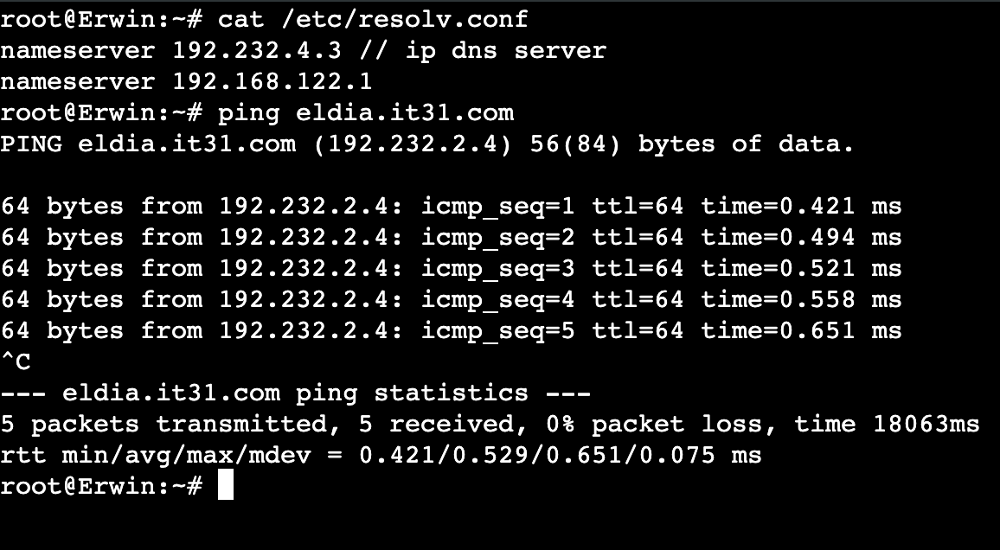

# Jarkom-Modul-2-IT31-2024

## Anggota Kelompok IT31 :

| Nama Lengkap         | NRP        |
| -------------------- | ---------- |
| Maulana Ahmad Zahiri | 5027231010 |
| Dzaky Faiq Fayyadhi  | 5027231047 |

## Daftar isi

- [Topology](#topology)
- [Configuration](#configuration)
- [Installation](#installation)
- [Nomor 1](#nomor-1)
- [Nomor 2](#nomor-2)
- [Nomor 3](#nomor-3)
- [Nomor 4](#nomor-4)

## Topology


### Prefix IP IT31 : 192.232

## Configuration

- Paradis (DHCP Relay)

```bash
auto eth0
iface eth0 inet dhcp

auto eth1
iface eth1 inet static
  address 192.232.1.1
  netmask 255.255.255.0

auto eth2
iface eth2 inet static
  address 192.232.2.1
  netmask 255.255.255.0

auto eth3
iface eth3 inet static
  address 192.232.3.1
  netmask 255.255.255.0

auto eth4
iface eth4 inet static
  address 192.232.4.1
  netmask 255.255.255.0

up iptables -t nat -A POSTROUTING -o eth0 -j MASQUERADE -s 192.232.0.0/16
```

- Tybur (DHCP Server)

```bash
auto eth0
iface eth0 inet static
  address 192.232.4.2
  netmask 255.255.255.0
  gateway 192.232.4.1

up echo nameserver 192.168.122.1 > /etc/resolv.conf
```

- Fritz (DNS Server)

```bash
auto eth0
iface eth0 inet static
  address 192.232.4.3
  netmask 255.255.255.0
  gateway 192.232.4.1

up echo nameserver 192.168.122.1 > /etc/resolv.conf
```

- Warhammer (Database)

```bash
auto eth0
iface eth0 inet static
  address 192.232.3.4
  netmask 255.255.255.0
  gateway 192.232.3.1

up echo nameserver 192.168.122.1 > /etc/resolv.conf
```

- Beast (Load Balancer Laravel)

```bash
auto eth0
iface eth0 inet static
  address 192.232.3.2
  netmask 255.255.255.0
  gateway 192.232.3.1

up echo nameserver 192.168.122.1 > /etc/resolv.conf
```

- Colossal (Load Balancer PHP)

```bash
auto eth0
iface eth0 inet static
  address 192.232.3.3
  netmask 255.255.255.0
  gateway 192.232.3.1

up echo nameserver 192.168.122.1 > /etc/resolv.conf
```

- Annie (Laravel Worker)

```bash
auto eth0
iface eth0 inet static
  address 192.232.1.2
  netmask 255.255.255.0
  gateway 192.232.1.1

up echo nameserver 192.168.122.1 > /etc/resolv.conf
```

- Berthold (Laravel Worker)

```bash
auto eth0
iface eth0 inet static
  address 192.232.1.3
  netmask 255.255.255.0
  gateway 192.232.1.1

up echo nameserver 192.168.122.1 > /etc/resolv.conf
```

- Reiner (Laravel Worker)

```bash
auto eth0
iface eth0 inet static
  address 192.232.1.4
  netmask 255.255.255.0
  gateway 192.232.1.1

up echo nameserver 192.168.122.1 > /etc/resolv.conf
```

- Mikasa (PHP Worker)

```bash
auto eth0
iface eth0 inet static
  address 192.232.2.2
  netmask 255.255.255.0
  gateway 192.232.2.1

up echo nameserver 192.168.122.1 > /etc/resolv.conf
```

- Eren (PHP Worker)

```bash
auto eth0
iface eth0 inet static
  address 192.232.2.3
  netmask 255.255.255.0
  gateway 192.232.2.1

up echo nameserver 192.168.122.1 > /etc/resolv.conf
```

- Armin (PHP Worker)

```bash
auto eth0
iface eth0 inet static
  address 192.232.2.4
  netmask 255.255.255.0
  gateway 192.232.2.1

up echo nameserver 192.168.122.1 > /etc/resolv.conf
```

- Zeke (Client)

```bash
auto eth0
iface eth0 inet static
  address 192.232.1.5
  netmask 255.255.255.0
  gateway 192.232.1.1

up echo nameserver 192.232.4.3 > /etc/resolv.conf // IP DNS Server
up echo nameserver 192.168.122.1 >> /etc/resolv.conf

```

- Erwin (Client)

```bash
auto eth0
iface eth0 inet static
  address 192.232.2.5
  netmask 255.255.255.0
  gateway 192.232.2.1

up echo nameserver 192.232.4.3 > /etc/resolv.conf // ip DNS Server
up echo nameserver 192.168.122.1 >> /etc/resolv.conf
```

## Installation

## Nomor 1

Pulau Paradis telah menjadi tempat yang damai selama 1000 tahun, namun kedamaian tersebut tidak bertahan selamanya. Perang antara kaum Marley dan Eldia telah mencapai puncak. Kaum Marley yang dipimpin oleh Zeke, me-register domain name marley.yyy.com untuk worker Laravel mengarah pada Annie. Namun ternyata tidak hanya kaum Marley saja yang berinisiasi, kaum Eldia ternyata sudah mendaftarkan domain name eldia.yyy.com untuk worker PHP (0) mengarah pada Armin.

- pertama agar lebih mudah kita dapat membuat script untuk memasang konfigurasi nantinya, pada DNS Server kita namakan script dengan file `fritz.sh` :

```bash
echo 'zone "marley.it31.com" {
        type master;
        file "/etc/bind/jarkom/marley.it31.com";
};

zone "eldia.it31.com" {
        type master;
        file "/etc/bind/jarkom/eldia.it31.com";
};' >/etc/bind/named.conf.local

mkdir /etc/bind/jarkom

echo ';
; BIND data file for local loopback interface
;
$TTL    604800
@       IN      SOA     marley.it31.com. root.marley.it31.com. (
                        2024051601      ; Serial
                        604800          ; Refresh
                        86400           ; Retry
                        2419200         ; Expire
                        604800 )        ; Negative Cache TTL
;
@               IN      NS      marley.it31.com.
@               IN      A       192.232.1.2 ; IP Annie Laravel Workerr' >/etc/bind/jarkom/marley.it31.com

echo ';
; BIND data file for local loopback interface
;
$TTL    604800
@       IN      SOA     eldia.it31.com.  eldia.it31.com.  (
                        2024051601      ; Serial
                        604800          ; Refresh
                        86400           ; Retry
                        2419200         ; Expire
                        604800 )        ; Negative Cache TTL
;
@               IN      NS      eldia.it31.com.
@               IN      A       192.232.2.4 ; IP Armin PHP Worker' >/etc/bind/jarkom/eldia.it31.com

echo 'options {
        directory "/var/cache/bind";

        forwarders {
                192.168.122.1;
        };

        // dnssec-validation auto;
        allow-query{any;};
        auth-nxdomain no;    # conform to RFC1035
        listen-on-v6 { any; };
}; ' >/etc/bind/named.conf.options

service bind9 restart

```

- setelah menjalankan script maka akan terbuat konfigurasi sesuai dengan script seperti berikut
  

- lalu setelahnya kita dapat melakukan `ping marley.it31.com` pada client `Zeke` dan `ping eldia.it31.com` pada client `Erwin` :





## Nomor 2

Jauh sebelum perang dimulai, ternyata para keluarga bangsawan, Tybur dan Fritz, telah membuat kesepakatan sebagai berikut:

Semua Client harus menggunakan konfigurasi ip address dari keluarga Tybur (dhcp).

Client yang melalui bangsa marley mendapatkan range IP dari `[prefix IP].1.05 - [prefix IP].1.25` dan `[prefix IP].1.50 - [prefix IP].1.100 (2)`

- pada Paradis (DHCP Relay) kita dapat membuat script bernama `paradis.sh` yang mengarah ke Tybur (DHCP Server)

```bash
apt-get update
apt-get install isc-dhcp-relay -y
service isc-dhcp-relay start

relay="SERVERS=\"192.232.4.3\"
INTERFACES=\"eth1 eth2 eth3 eth4\"
OPTIONS=\"\"
"
echo "$relay" >/etc/default/isc-dhcp-relay

echo net.ipv4.ip_forward=1 >/etc/sysctl.conf

service isc-dhcp-relay restart

```

- setalah script diatas dijalankan, kita dapat masuk ke Tybur (DHCP Server) dan membuat script `marley.sh` untuk setup subnet marley

```
echo 'subnet 192.232.3.1 netmask 255.255.255.0 {
    option routers 192.232.3.1;
}

subnet 192.232.4.1 netmask 255.255.255.0 {
    option routers 192.232.4.1;
}

subnet 192.232.1.1 netmask 255.255.255.0 {
    range 192.232.1.5 192.232.1.25;
    range 192.232.1.50 192.232.1.100;
    option routers 192.232.1.2;
}' > /etc/dhcp/dhcpd.conf
```

## Nomor 3

Client yang melalui bangsa eldia mendapatkan range IP dari [prefix IP].2.09 - [prefix IP].2.27 dan [prefix IP].2 .81 - [prefix IP].2.243 (3)

- setelah tadi setup subnet dari `marley` maka sekarang kita setup subnet untuk `eldia`. kita dapat membuat script `eldia.sh`

```bash
echo 'subnet 192.232.3.1 netmask 255.255.255.0 {
    option routers 192.232.3.1;
}

subnet 192.232.4.1 netmask 255.255.255.0 {
    option routers 192.232.4.1;
}

subnet 192.232.1.1 netmask 255.255.255.0 {
    range 192.232.1.5 192.232.1.25;
    range 192.232.1.50 192.232.1.100;
    option routers 192.232.1.2;
}

subnet 192.232.2.1 netmask 255.255.255.0 {
    range 192.232.2.09 192.232.2.27;
    range 192.232.2.81 192.232.1.243;
    option routers 192.232.2.4;
}' >/etc/dhcp/dhcpd.conf

```

## Nomor 4
